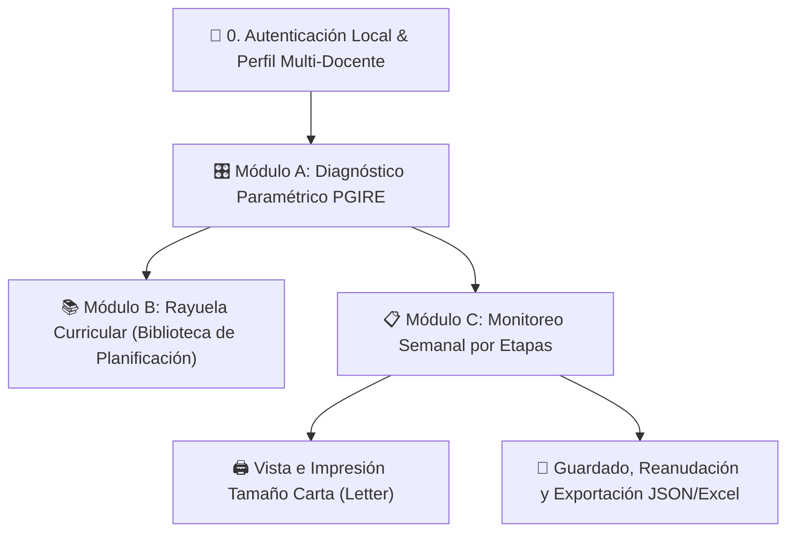

# 📘 DOCUMENTO MAESTRO DE INTEGRACIÓN: PROYECTO 1 & PROYECTO 2 (WEB)
**Iniciativa de Flexibilización y Adaptación Curricular en Situaciones de Emergencia (NRC / MEN)**

---

## 📌 1. Resumen Ejecutivo y Alcance
Este documento constituye la **fuente única de verdad (Single Source of Truth)** para la articulación entre el **Proyecto 1** (modelación curricular en hojas de cálculo, soporte normativo PGIRE/GIRE, matrices DBA y productos metodológicos) y el **Proyecto 2** (plataforma web interactiva *Open Source*, diseñada para despliegue en subdominio Linux y ejecución local autónoma).

---

## 🏛️ 2. Marco Normativo y Pedagógico Integrado

| Eje Normativo / Técnico | Instrumento Legal | Aplicación en la Herramienta |
| :--- | :--- | :--- |
| **Gestión Integral del Riesgo Escolar (GIRE)** | *Resolución MEN 6519 de 2025* | Gobernanza escolar, articulación con Comités Institucionales CIGIRE y Mesas Territoriales MTGIRE. |
| **Directrices de Emergencia Educativa** | *Circular MEN 19 de 2022* | Protocolos de atención inmediata y adaptación del calendario escolar. |
| **Gestión del Riesgo de Desastres** | *Ley 1523 de 2012* | Clasificación macro de amenazas (Natural, Socionatural, Antrópica, Conflicto Armado). |
| **Estándares Humanitarios Internacionales** | *Normas Mínimas INEE (MSEE)* | Protección infantil, espacios amigables, bienestar psicosocial y núcleos de aprendizaje esencial. |
| **Validez y Acreditación Académica** | *Decreto 1075 de 2015 / SIEE* | Garantía de que los aprendizajes flexibilizados mantienen trazabilidad y validez en el sistema evaluativo. |

---

## 🧠 3. Arquitectura del Modelo de Datos (5 Ciclos y 40 Amenazas PGIRE)

### 3.1. Estructura de los 5 Ciclos Formativos Estandarizados
1. **Ciclo I (Grados 1°, 2° y 3° - Básica Primaria Inicial):** Alfabetización inicial, conteo contextualizado, nociones espaciales, autocuidado y 81 DBA oficiales MEN.
2. **Ciclo II (Grados 4° y 5° - Básica Primaria Superior):** Comprensión textual, operaciones aplicadas, ciencias del entorno, convivencia y 55 DBA oficiales MEN.
3. **Ciclo III (Grados 6° y 7° - Básica Secundaria Inicial):** Transición a básica secundaria, análisis crítico, resolución de problemas, pensamiento científico y 57 DBA oficiales MEN.
4. **Ciclo IV (Grados 8° y 9° - Básica Secundaria Superior):** Argumentación, pensamiento abstracto, ciudadanía activa, saneamiento ambiental WASH y 57 DBA oficiales MEN.
5. **Ciclo V (Grados 10° y 11° - Educación Media):** Educación media, formulación de proyectos comunitarios, mitigación del riesgo, preparación SIEE/Saber 11 y 47 DBA oficiales MEN.

### 3.2. Taxonomía de Bloom y Relación de Compensación Humanitaria
$$\text{Mayor Gravedad de la Crisis (Etapa 1 / Afectación Alta)} \Longrightarrow \text{Menor Complejidad Cognitiva Inicial (Bloom 1-2: Recordar / Comprender)}$$
* **Etapa 1 (Respuesta Inmediata - Semanas 1 a 4):** Complejidad Baja / Esencial (*Bloom 1-2: Recordar / Comprender*). Enfoque en contención emocional, alfabetización mínima y supervivencia.
* **Etapa 2 (Recuperación Temprana - Semanas 6 a 25):** Complejidad Media / Intermedia (*Bloom 3-4: Aplicar / Analizar*). Enfoque en proyectos integrados y reconstrucción de rutinas.
* **Etapa 3 (Retorno / Educación Formal - Más de 25 semanas):** Complejidad Alta / Profundización (*Bloom 5-6: Evaluar / Crear*). Enfoque en avance curricular pleno y acreditación formal.

---

## 💻 4. Especificación Funcional de la Plataforma Web (Proyecto 2)



### 4.1. Módulo A: Diagnóstico Paramétrico y Control (Soporte Multirriesgo e Inducción Pedagógica)
* **Inducción Pedagógica Previa (5 Guías Normativas Oficiales):**
  * 4 preguntas generadoras de apropiación en terreno.
  * **Guía 1.1:** Etapas de Respuesta a la Emergencia.
  * **Guía 1.2:** Escala Unificada de Afectación Educativa y Taxonomía de Bloom (Pág. 7).
  * **Guía 1.3:** Categorías de Riesgo Prevalente PGIRE (*Ley 1523 de 2012 / Res. MEN 6519 de 2025*).
  * **Guía 1.4:** Enfoque de Habilidades para la Vida y Desarrollo Socioemocional (*Ley 2383/2024, Ley 2491/2025, MEN 2026, UNICEF 2025*).
  * **Guía 1.5:** Capa de Protección y Aprendizajes de Supervivencia WASH/ERM (*Normas Mínimas INEE / Política Pública GIRE*).
* **Formulario Paramétrico Multirriesgo:**
  1. `Selección de Ciclo` (Ciclos I al V).
  2. `1. Etapa de Respuesta a la Emergencia` $\rightarrow$ Auto-calcula `2. Nivel de Complejidad Cognitiva Bloom`.
  3. `3. Tipo / Categoría Macro de Amenaza PGIRE` $\rightarrow$ Selección manual múltiple sin opción "Todas" (*Natural*, *Socionatural*, *Antrópica*, *Conflicto Armado y Protección*).
  4. `4. Amenaza(s) Específica(s) Diagnosticada(s)` $\rightarrow$ Filtro dinámico y selección múltiple de amenazas concurrentes (40 amenazas PGIRE).
  5. Despliegue consolidado multilínea automático de:
     * `5. Ejemplo(s) en Institución Educativa`
     * `6. Riesgos Asociados en la Institución Educativa`
     * `7. Instancia(s) GIRE Responsable(s) y Ruta(s)` (*Ruta de Protección Humanitaria*, *Mesa Territorial MTGIRE* o *Comité CIGIRE*).
  6. Entradas del docente:
     * `8. Grado Escolar en Aula`
     * `9. Matrícula de NNA en Aula` $\rightarrow$ Determina estrategia: *Tutoría 1:1 (<15)*, *Cooperativo (15-35)* o *Micro-estaciones (>35)*.
     * `10. Fecha de Inicio de la Emergencia` $\rightarrow$ Genera el calendario semanal proyectado.
* **Resumen de Diagnóstico:** Botón "Guardar y Aplicar Diagnóstico de Aula" y tarjeta de confirmación de parámetros con badges por cada amenaza diagnosticada.

### 4.2. Módulo B: Rayuela Curricular (Biblioteca de Planificación)
* Espacio de exploración profunda de la malla curricular priorizada con **encabezados contextualizados por tipología**:
  * **Áreas Académicas (Lenguaje, Matemáticas, Sociales, Naturales):**
    * Encabezados: `Factor / Eje` | `DBA / Aprendizaje Esencial` | `Complejidad & Bloom` | `Didáctica Situada / Mini-Proyecto`.
  * **Socioemocional & Vida:**
    * Encabezados: `Dimensión & Etapa de Respuesta` | `Habilidad & Objetivo de Aprendizaje (Bloom)` | `Proceso Cognitivo (Bloom)` | `Contenido de Aprendizaje & Evidencias Clave`.
  * **Supervivencia & ERM:**
    * Encabezados: `Tipología de Riesgo & Afectación` | `Aprendizaje Clave & Objetivo de Protección` | `Proceso Cognitivo (Bloom)` | `Mini-Proyecto Situado & Fases de Acción`.
    * **Priorización Contextual:** Resalta automáticamente con badge los mini-proyectos de protección que responden al diagnóstico de amenazas activas en el Módulo A.

### 4.3. Módulo C: Monitoreo Semanal por Etapas (Integración Completa por Semanas)
* Tablero dinámico de seguimiento semana a semana (Semanas 1 a 16 / 32 / 64):
  * **Tarjeta Pedagógica Semanal Integrada:** Agrupa en cada semana: *Grado + Estrategia NNA + Amenazas PGIRE + DBA Nuclear + Didáctica Situada + Desafío Bloom + Habilidad Socioemocional + Mini-Proyecto de Protección WASH/ERM*.
  * **Registro y Trazabilidad Temporal:** Guarda automáticamente la marca de tiempo exacta (`fechaRegistro`) en que el docente guardó cada avance.
  * **Exportación a Excel Directa:** Descarga de hoja de cálculo estructurada (`.csv` con UTF-8 BOM y delimitador `;`) que abre directamente en Microsoft Excel, Google Sheets o Calc con todas las columnas organizadas.
  * **Impresión Oficial en Tamaño Carta (Letter):** Maquetación CSS estricta (`print.css`), sin páginas en blanco iniciales, con encabezado oficial MEN / NRC y bloque institucional de firmas para acreditación en el SIEE.

### 4.4. Capa Transversal y Experiencia de Usuario Multi-Dispositivo
* **Navegación Sticky:** La barra superior y los botones de los 3 módulos permanecen siempre fijos y visibles al hacer scroll hacia abajo.
* **Diseño Responsivo Total:** Adaptado y optimizado para teléfonos celulares (<680px), tablets (680px-992px), laptops y computadores de escritorio.
* **100% Offline-First / PWA:** Ejecución local autónoma sin conexión vía `index.html` o `app_standalone.html`.
* **Multi-Perfil Local:** Varios docentes pueden usar la misma máquina con contraseñas locales sin cruzar sus datos.
* **Exportación / Respaldo:** Capacidad de descargar e importar bitácoras en formato JSON/Excel.

---

## 🌐 5. Directrices de Despliegue en Subdominio Linux (Open Source)

### 5.1. Entorno de Producción
* **Servidor:** Linux (Debian / Ubuntu / Rocky Linux / Alpine).
* **Hardware:** 4 vCPUs, 500 GB de almacenamiento libre.
* **Servidor Web:** Nginx, Apache HTTP Server o Caddy.
* **Cero Dependencia de Servidores Propietarios:** Sin necesidad de Windows Server ni bases de datos SQL comerciales.

### 5.2. Configuración Nginx Recomendada para Subdominio
```nginx
server {
    listen 80;
    server_name nrc-curricular.tudominio.org; # Reemplazar con el subdominio asignado

    root /var/www/nrc-herramienta-web;
    index index.html;

    location / {
        try_files $uri $uri/ /index.html;
    }

    # Caché estática y compresión Gzip para rendimiento óptimo
    gzip on;
    gzip_types text/plain text/css application/json application/javascript text/xml application/xml;
    location ~* \.(jpg|jpeg|png|gif|ico|css|js|woff2)$ {
        expires 30d;
        add_header Cache-Control "public, no-transform";
    }
}
```

### 5.3. Ejecución y Prueba Local Autónoma
Para probar la aplicación en tu ordenador sin necesidad de instalar entornos complejos:
1. **Opción Directa:** Doble clic sobre `index.html` en cualquier navegador web moderno.
2. **Opción Servidor Ligero:** Ejecutar en terminal `python -m http.server 8080` o `npx serve .` y abrir `http://localhost:8080`.

### 5.4. Despliegue Continuo Automático en GitHub Pages (CI/CD)
* **Repositorio Oficial:** `https://github.com/Sebaspaezt/adaptacioncurricular`
* **URL en Producción Web (En Vivo):** [https://sebaspaezt.github.io/adaptacioncurricular/](https://sebaspaezt.github.io/adaptacioncurricular/)
* **Flujo de Automatización Autónoma:** Cada ajuste realizado y procesado en el desarrollo es ejecutado y sincronizado automáticamente por el asistente de desarrollo (**Antigravity**) mediante `git push` a la rama `main`, garantizando que cada iteración quede inmediatamente reflejada en vivo en la plataforma web de GitHub Pages sin requerir acciones manuales del usuario.


