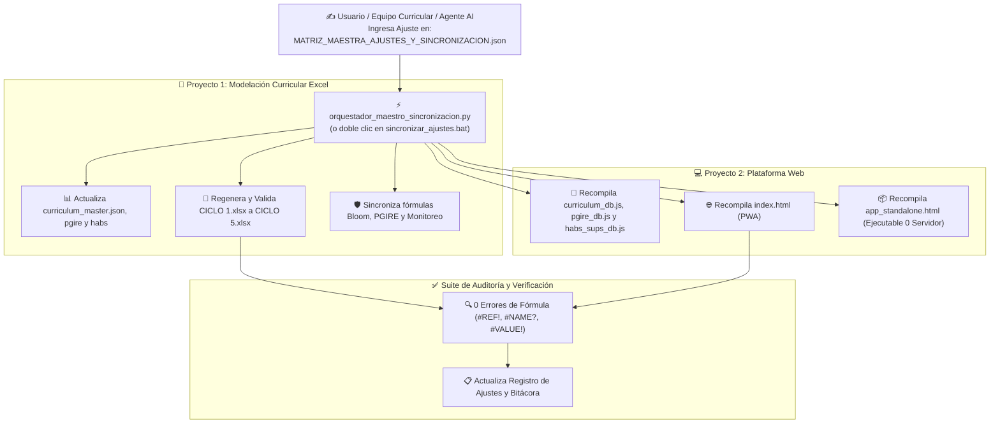

# 🌐 MATRIZ MAESTRA DE AJUSTES Y SINCRONIZACIÓN (PROYECTO 1 & PROYECTO 2)
**Iniciativa de Flexibilización y Adaptación Curricular en Situaciones de Emergencia (NRC / MEN)**  
*Hub Central de Orquestación Curricular, Matrices Excel y Plataforma Web Interactiva*

---

## 📌 1. Propósito y Alcance del Archivo Maestro

Este documento y su dataset estructurado [MATRIZ_MAESTRA_AJUSTES_Y_SINCRONIZACION.json](file:///e:/Proyectos%20antigravity/NRC/Proyecto%20herramienta%202%20(web)/MATRIZ_MAESTRA_AJUSTES_Y_SINCRONIZACION.json) constituyen el **Centro Único de Control y Entrada de Ajustes (Single Source of Truth & Control Hub)** para todo el ecosistema pedagógico y tecnológico de la iniciativa.

Permite que cualquier cambio pedagógico, normativo, didáctico o técnico que se ingrese sea aplicado **simultáneamente y de manera sincronizada** en:

1. **Proyecto 1 (Modelación en Hojas de Cálculo):**
   * Libros Excel Multiciclo: [CICLO 1.xlsx](file:///e:/Proyectos%20antigravity/NRC/Proyecto%20herramienta%201/CICLOS/CICLO%201.xlsx), [CICLO 2.xlsx](file:///e:/Proyectos%20antigravity/NRC/Proyecto%20herramienta%201/CICLOS/CICLO%202.xlsx), [CICLO 3.xlsx](file:///e:/Proyectos%20antigravity/NRC/Proyecto%20herramienta%201/CICLOS/CICLO%203.xlsx), [CICLO 4.xlsx](file:///e:/Proyectos%20antigravity/NRC/Proyecto%20herramienta%201/CICLOS/CICLO%204.xlsx) y [CICLO 5.xlsx](file:///e:/Proyectos%20antigravity/NRC/Proyecto%20herramienta%201/CICLOS/CICLO%205.xlsx).
   * Libro Enriquecido Base: [CICLO III RIESGOS.xlsx](file:///e:/Proyectos%20antigravity/NRC/Proyecto%20herramienta%201/CICLO%20III%20RIESGOS.xlsx).
   * Tablas maestras de `Rayuela Curricular`, `Monitoreo Semanal por Etapas`, 4 áreas del conocimiento, habilidades socioemocionales y catálogo PGIRE.
2. **Proyecto 2 (Plataforma Web Interactiva / PWA):**
   * Bases de datos en JavaScript: `curriculum_db.js`, `pgire_db.js`, `habs_sups_db.js`.
   * Módulos interactivos: Módulo A (Diagnóstico Paramétrico), Módulo B (Rayuela Curricular), Módulo C (Monitoreo Semanal), Módulo D (Autenticación Offline / Multiperfil).
   * Despliegues web: Versión modular PWA [index.html](file:///e:/Proyectos%20antigravity/NRC/Proyecto%20herramienta%202%20(web)/index.html) y versión autónoma sin dependencias [app_standalone.html](file:///e:/Proyectos%20antigravity/NRC/Proyecto%20herramienta%202%20(web)/app_standalone.html).

---

## 🔄 2. Arquitectura del Flujo de Sincronización Automática



---

## 🏛️ 3. Coordinación con los Documentos Maestros del Ecosistema

Este archivo maestro se encuentra enlazado y alineado con los documentos estratégicos de ambos proyectos:

* [DOCUMENTO_MAESTRO_INTEGRACION_PROYECTO_1_Y_2.md](file:///e:/Proyectos%20antigravity/NRC/Proyecto%20herramienta%201/DOCUMENTO_MAESTRO_INTEGRACION_PROYECTO_1_Y_2.md): Define la arquitectura conceptual, directrices de despliegue en Linux (Nginx) y marco normativo conjunto.
* [Plan mejoras rayuela.md](file:///e:/Proyectos%20antigravity/NRC/Proyecto%20herramienta%201/Plan%20mejoras%20rayuela.md): Especificación técnica de fórmulas OpenXML, dashboard de control y visualizadores.
* [bitácora_avance.md](file:///e:/Proyectos%20antigravity/NRC/Proyecto%20herramienta%201/bit%C3%A1cora_avance.md): Registro cronológico de hitos, pruebas y control de versiones.
* [README.md (Proyecto 1)](file:///e:/Proyectos%20antigravity/NRC/Proyecto%20herramienta%201/README.md): Mapa general del repositorio de modelación curricular.
* [README.md (Proyecto 2)](file:///e:/Proyectos%20antigravity/NRC/Proyecto%20herramienta%202%20(web)/README.md): Documentación y guía de despliegue de la aplicación web.

---

## 📝 4. ¿Cómo Ingresar y Aplicar Nuevos Ajustes?

### Paso 1: Abrir el Archivo JSON de Configuración
Abrir [MATRIZ_MAESTRA_AJUSTES_Y_SINCRONIZACION.json](file:///e:/Proyectos%20antigravity/NRC/Proyecto%20herramienta%202%20(web)/MATRIZ_MAESTRA_AJUSTES_Y_SINCRONIZACION.json).

### Paso 2: Registrar el Ajuste en `registro_ajustes`
Agregar una nueva entrada al inicio de la lista con estado `"PENDIENTE"`:
```json
{
  "id": "AJUSTE-2026-002",
  "fecha": "2026-08-26",
  "autor": "Nombre del Profesional / Rol",
  "componente": "CICLO_3",
  "area_o_modulo": "Ciencias Sociales",
  "tipo_ajuste": "ACTUALIZACION_SABERES",
  "descripcion": "Incorporación de nueva didáctica situada para memoria de paz.",
  "estado": "PENDIENTE",
  "afecta_excel_p1": true,
  "afecta_web_p2": true
}
```

### Paso 3: Modificar los Datos en la Sección Correspondiente
* **Ajustes Curriculares por Ciclo:** Editar la sección `ecosistema_curriculo_multiciclo -> ["1" | "2" | "3" | "4" | "5"] -> ["lenguaje" | "matematicas" | "sociales" | "naturales"]`.
* **Ajustes a Amenazas PGIRE:** Modificar o añadir en `catalogo_pgire_40_amenazas`.
* **Ajustes a Habilidades Socioemocionales:** Modificar en `habilidades_socioemocionales_y_supervivencia`.
* **Ajustes a Reglas Didácticas / Matrícula:** Modificar en `reglas_calendario_y_monitoreo`.

### Paso 4: Ejecutar la Sincronización Automática
Elegir una de las siguientes dos opciones:

* **Opción A (1-Click Windows):** Doble clic en [sincronizar_ajustes.bat](file:///e:/Proyectos%20antigravity/NRC/Proyecto%20herramienta%202%20(web)/sincronizar_ajustes.bat).
* **Opción B (Terminal / Consola):**
  ```powershell
  cd "E:\Proyectos antigravity\NRC\Proyecto herramienta 2 (web)"
  python orquestador_maestro_sincronizacion.py
  ```

El orquestador procesará los datos, actualizará todos los libros Excel de Proyecto 1, recompilará las bases JS y vistas HTML de Proyecto 2, verificará 0 errores de fórmula y marcará el ajuste como `"APLICADO"`.

---

## 🗂️ 5. Catálogo de Parámetros Estandarizados

### 5.1. Etapas de Emergencia y Complejidad Bloom
| Etapa de Emergencia | Rango Temporal | Complejidad Cognitiva Bloom | Enfoque Pedagógico Prioritario |
| :--- | :--- | :--- | :--- |
| **ETAPA 1** | Semanas 1 a 4 | **Baja / Esencial (Bloom 1-2: Recordar / Comprender)** | Contención emocional, autocuidado, supervivencia y alfabetización básica. |
| **ETAPA 2** | Semanas 6 a 25 | **Media / Intermedia (Bloom 3-4: Aplicar / Analizar)** | Proyectos interdisciplinares, reconstrucción de rutinas y nivelación. |
| **ETAPA 3** | Más de 25 semanas | **Alta / Profundización (Bloom 5-6: Evaluar / Crear)** | Avance curricular pleno, pensamiento crítico y acreditación SIEE. |

### 5.2. Estrategia Didáctica Situada según Matrícula en Aula
| Matrícula de NNA | Estrategia Asignada | Dinámica de Trabajo en Aula |
| :--- | :--- | :--- |
| **$< 15$ NNA** | **📝 TUTORÍA 1:1** | Acompañamiento focalizado personalizado y guías adaptadas. |
| **$15 - 35$ NNA** | **👥 TRABAJO COOPERATIVO** | Grupos pequeños, roles rotativos y aprendizaje colaborativo. |
| **$> 35$ NNA** | **⚡ MICRO-ESTACIONES** | Circuitos rotativos de aprendizaje autónomo con estaciones temáticas. |

### 5.3. Instancias de Gobernanza GIRE y Rutas de Activación
| Instancia GIRE | Articulación Interinstitucional | Ámbito de Activación |
| :--- | :--- | :--- |
| **🛡️ Ruta de Protección Humanitaria** | CIGIRE + ICBF + Defensoría + Personería + NRC | Conflicto armado, minas (MAP/MUSE), reclutamiento, VBG, desplazamiento. |
| **🏙️ Mesa Territorial (MTGIRE)** | UNGRD + CMGRD + CDGRD + Alcaldía + Bomberos | Desastres socionaturales (inundación, remoción en masa, vendaval, sismo). |
| **🏫 Comité Institucional (CIGIRE)** | Rectoría + Docentes Líderes + Brigadas Escolares | Riesgos tecnológicos internos, fallas locativas y eventos de salud pública. |

---

## 📈 6. Registro Histórico de Versiones y Sincronizaciones

| Versión | Fecha | Responsable | Resumen de Cambios | Estado |
| :---: | :---: | :--- | :--- | :---: |
| **v2.0.0** | 2026-08-26 | Equipo NRC / AGY | Creación del Hub Maestro de Sincronización Bidireccional (Proyecto 1 ↔ Proyecto 2), integración de 5 Ciclos, 40 amenazas PGIRE y automatización 1-click. | **OPERATIVO** |
| **v2.1.0** | 2026-08-27 | Equipo NRC / AGY | Homologación integral multiciclo de bases relacionales de DBA oficiales MEN en los 5 libros Excel (Ciclos I, II, III, IV y V: 297 registros oficiales), corrección de encabezados de mallas y sincronización con plataforma web. | **OPERATIVO** |
| **v2.2.0** | 2026-08-27 | Equipo NRC / AGY | Depuración curricular integral y graduación por franja de edad (6 a 17 años) en las 4 áreas (Lenguaje, Matemáticas, Ciencias Sociales y Naturales), eliminación de filas residuales de Ciclo III, calibración de EBC, Bloom y miniproyectos situados en Excel y Web. | **OPERATIVO** |


